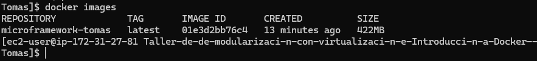
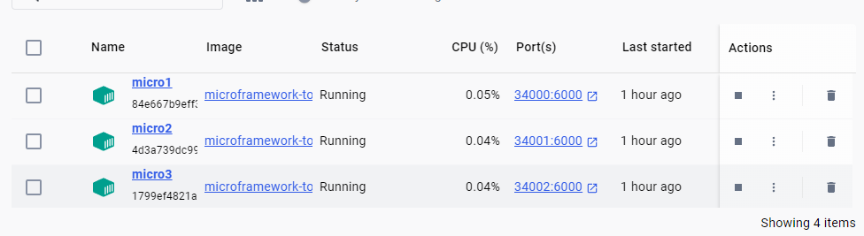
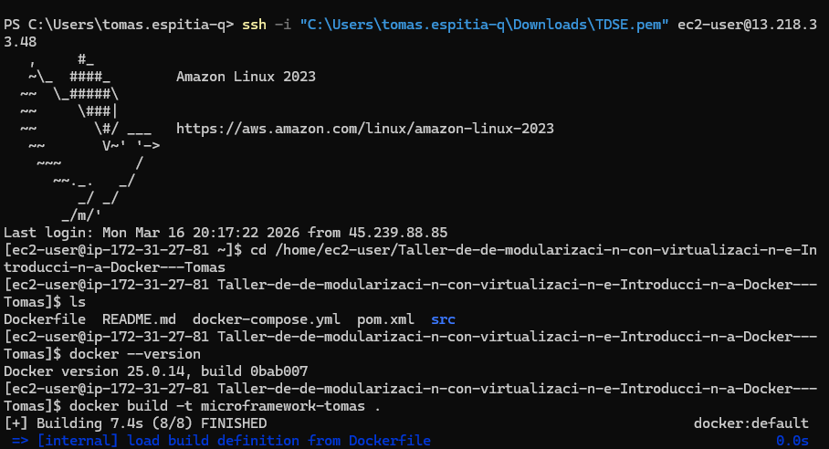
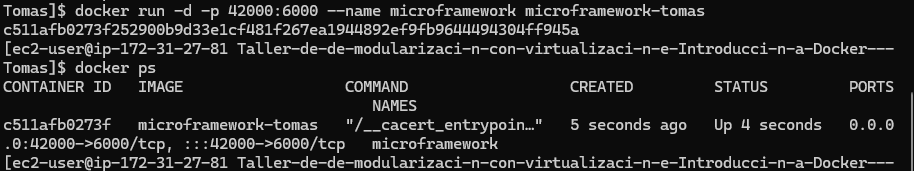
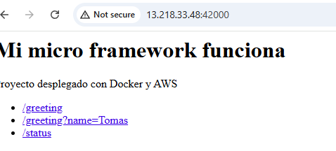

# Taller de Arquitecturas de Servidores de Aplicaciones – Tomas Espitia

Este proyecto implementa un micro framework web en Java inspirado en el funcionamiento básico de frameworks como Spring Boot.
El objetivo es comprender cómo funcionan internamente conceptos como controladores, rutas HTTP, anotaciones y servidores web, además de aprender a contenedorizar la aplicación con Docker y desplegarla en una instancia EC2 de AWS.

El framework permite definir controladores con anotaciones y exponer endpoints HTTP accesibles desde un navegador. La aplicación fue desplegada utilizando contenedores Docker en la nube, permitiendo acceder al servicio desde internet.

---

# Getting Started

Estas instrucciones permiten obtener una copia del proyecto y ejecutarlo en un entorno local o desplegarlo utilizando Docker y AWS EC2.

---

# Prerequisites

Para ejecutar el proyecto necesitas tener instalado:

* Java 17
* Maven
* Docker
* Git
* AWS con acceso a EC2

# Installing

## 1. Clonar el repositorio

```bash
git clone https://github.com/t0masespitia/Taller-de-Arquitecturas-de-Servidores-de-Aplicaciones---Tomas-Espitia
cd Taller-de-Arquitecturas-de-Servidores-de-Aplicaciones---Tomas-Espitia
```

---

## 2. Compilar el proyecto

```bash
mvn clean package
```

Esto generará el artefacto en la carpeta:

```
target/
```

---

## 3. Ejecutar la aplicación localmente

```bash
java -cp target/classes edu.tdse.MicroSpringBoot edu.tdse.ejemplo.GreetingController
```

El servidor se inicia en:

```
http://localhost:6000
```

---

## 4. Construir la imagen Docker

```bash
docker build -t microframework-tomas .
```
contruimos las imagenes con 
---

## 5. Ejecutar el contenedor

```bash
docker run -d -p 42000:6000 --name microframework microframework-tomas
```

# Running the tests

Para probar el funcionamiento del micro framework se pueden acceder a los siguientes endpoints:

### Página principal

```
http://localhost:42000
```

### Endpoint de saludo

```
http://localhost:42000/greeting
```

### Endpoint con parámetro

```
http://localhost:42000/greeting?name=Tomas
```

### Estado del servidor

```
http://localhost:42000/status
```

Estos endpoints demuestran que el framework es capaz de:

* registrar controladores
* interpretar rutas HTTP
* manejar parámetros de consulta
* devolver respuestas dinámicas

---

# Deployment

La aplicación fue desplegada en AWS EC2 utilizando Docker.

Pasos realizados:

1. Creación de una instancia EC2 con *mazon Linux 2023
2. Conexión mediante SSH usando una llave `.pem`
3. Instalación de Docker en la instancia
4. Copia del proyecto hacia la instancia usando `scp`
5. Construcción de la imagen Docker dentro de EC2
6. Ejecución del contenedor exponiendo el puerto 42000
7. Configuración del security Group para permitir tráfico en el puerto 42000


Pruebas:
1. 
2. 
3. 
4. 
5. 


# Arquitectura del despliegue


Usuario Lluego Internet luego AWS EC2 Instance luego Docker Container luego MicroFramework Java


# Built With

* Java 17
* Maven
* Docker
* AWS EC2
* Amazon Linux 2023

---

# Author

Tomas Espitia

Estudiante de Ingeniería de Sistemas

